## VS code extensions     
- rust     
- rust sytax (if doesn't come with rust extension)
- cortex-debug      

## MCU specific       
STM32CubeCLT(Tools for Third party IDEs) 
- In MacOSx you can find it in `/opt/ST/STM32CubeCLT_1.21.0` after download and installing `st-stm32cubeclt_1.21.0_27995_20260219_1804-macosx_x86_64.pkg` and `st-stlink-server.2.1.2-1.pkg`    

## Cortext-debug (VScode extension settings)      
You have to intergrate the **cortex-debug** VS code extension with **STM32CubeCLT**.    
- Go to VS code's Extension tab, click *cortex-debug* and click *settings* icon and go to *Settings*     

### Click **Cortex-Debug** and **External: GNU Tools** and write followings   
1- Click **Cortex-Debug: Arm Toolchain path** > **Edit in settings.json** as `"cortex-debug.armToolchainPath": "/opt/ST/STM32CubeCLT_1.21.0/GNU-tools-for-STM32/bin",`      
2- Click **Cortex-Debug: Arm Toolchain prefix** > **Edit in settings.json** as `"cortex-debug.armToolchainPrefix": "arm-none-eabi"`   

### Click **Cortex-Debug** and **External: GDB Servers** and write followings       
1- Click **Cortex-Debug: Stlink path > **Edit in settings.json** as `"cortex-debug.stlinkPath": "/opt/ST/STM32CubeCLT_1.21.0/STLink-gdb-server/bin/ST-LINK_gdbserver",`      
     
> [!IMPORTANT]     
> remove **.osx** at the end of `"cortex-debug.armToolchainPath"` and `"cortex-debug.stlinkPath"`    

### Go to Settings > Open Settings (JSON)     
Your settings json should look like following:      
```json
  "cortex-debug.armToolchainPath": "/opt/ST/STM32CubeCLT_1.21.0/GNU-tools-for-STM32/bin",
  "cortex-debug.stlinkPath": "/opt/ST/STM32CubeCLT_1.21.0/STLink-gdb-server/bin/ST-LINK_gdbserver",
  "cortex-debug.armToolchainPrefix": "arm-none-eabi",
```      
    
## Configure Tasks      
In VS code go to menu **Terminal** > **Configure Task...** and type `cargo build` and hit enter. That will create **tasks.json** with the following content      
```json
{
	"version": "2.0.0",
	"tasks": [
		{
			"type": "cargo",
			"command": "build",
			"problemMatcher": [
				"$rustc"
			],
			"group": "build",
			"label": "rust: cargo build[MCU]"
		}
	]
}
```   
Change the **label** from `"rust: cargo build"` to `"rust: cargo build[MCU]"` to distinguish your created tasks from other     

> [!NOTE]     
> Shortcut to run the task **CMD + Shift + P** and click or type in **Tasks: Run task** and it will show the label of your task as **rust: cargo build[MCU]**       
    
## Create launch option      
Click play button in VS code and click **create a launch.json file** and select **Cortex Debug** which will create **launch.json** and that should look like following; you should include `"svdFile"` and `"device"` as well. And also add the **pre launch task**, a task you created previously.    
```json
{
  "version": "0.2.0",
  "configurations": [

    {
      "name": "Cortex Debug",
      "cwd": "${workspaceFolder}",
      "executable": "${workspaceFolder}/target/thumbv7em-none-eabihf/debug/my_first_mcu_project",
      "request": "launch",
      "type": "cortex-debug",
      "runToEntryPoint": "main",
      "servertype": "stlink",
      "svdFile" : "/opt/ST/STM32CubeCLT_1.21.0/STMicroelectronics_CMSIS_SVD/STM32F303.svd",
      "device" : "STM32F303",
      "preLaunchTask": "rust: cargo build[MCU]",
      "showDevDebugOutput": "raw"
    }
  ]
}
```  
   
## Run the program     
In VS code menu click **Run** and click **Start debugging**   

## View memory        
- `CMD + Shift + P` and write **>Cortex-Debug: View Memory** 
- Now mention the memory in the box (i.e. *Create new memory view*) `0x20000000`       

       
## To inspect binaries (ELF)           
**cargo-binutils**     
- `cargo install cargo-binutils`      
- `rustup component add llvm-tools-preview`          

## probe-rs           
- Previously we use Cortex-Debug VS Code extension to download and debug the ELF file onto the target hardware.      
- Similarlly probe-rs tool is an embedded debugging and target interaction toolkit. we will explore how to flash the ELF file onto the target hardware using this tool.    
- **install** it with `cargo install probe-rs-tools --locked`    
- to check **supported chips** run `probe-rs chip list`    
- to **flash** once you find out your chip being supported by probe-rs, run `cargo flash --chip STM32F303CC`    
- to know **more commands** with `cargo flash ...` run `cargo flash --help`      
- **another way of flashing** elf file using `cargo run` but you have to edit `.cargo/config.toml` mention the **runner** as follows      
```toml
[build]
target = "thumbv7em-none-eabihf"

[target.thumbv7em-none-eabihf]
rustflags = [
  "-C", "link-arg=-Tmemory.ld"
]
runner = 'probe-rs run --chip STM32F303CC'
```    
> [!IMPORTANT]    
> After mentioning **runner** in the `.cargo/config.toml` dont forget to do `cargo build` then you can do `cargo run` to flash the target     
> after flashing the debugging session remains on until you terminate with the ctrl+c to stop interacting with the board via the debugger.         
      
## Creare project     
`cargo new my_first_mcu_project`    
   

## Build project (native compilation, same host+target) 
`cargo build`      
     

## Build project (cross compilation, for different target)           
- find the target first with `rustup target list`     

| ARM Cortex Mx Processor  | Architecture | `rustup target list` |  
|--------------------|--------|-----------|
| Arm Cortex-M0 | Armv6-M | `thumbv6m-none-eabi` |
| Arm Cortex-M0+ | Armv6-M | `thumbv6m-none-eabi` | 
| Arm Cortex-M3  | Armv7-M | `thumbv7m-none-eabi` | 
| Arm Cortex-M4     | Armv7E-M | `thumbv7em-none-eabi`, or `-eabihf` |
| Arm Cortex-M7     | Armv7E-M | `thumbv7em-none-eabi`, or `-eabihf` |       
       
` rustup target add thumbv7em-none-eabihf`       

`cargo build --target thumbv7em-none-eabihf`    
   
- **thumbv7em**: rustc generates code for target architecture: ARM Cortext-M (Thumb instruction set, ARMv7-M architecutre).  
- **none**: without any operating system.    
- **eabihf**: code will adhere to the ARM Embedded Application Interface (EABI) with hardware floating-point support.   
   
> [!IMPORTANT]  
> If error **error[E0463]: can't find crate for `std`**.    
> **note: the `thumbv7em-none-eabihf` target may not be installed**.    
> install it with `rustup target add thumbv7em-none-eabihf`     
    
> [!NOTE]  
> If error **error[E0463]: can't find crate for `std`**.    
> **note: the `thumbv7em-none-eabihf` target may not support the standard library**.    
> In bare-metal systems, **no_std** means the rust standard library (std) is not available because there is no operating system to provide features like file I/O, threads, or heap memory. You must use the core library for basic functionality and handle everything directly with the hardware.       

### **loop {...}**      
will run forever unless explicitly terminated by a **break**, **return** statement, or an **error/panic**     
    
### Attributes (like `#![no_std]`)      
Attributes provide instructions and metadata to the compiler, affecting code interpretation. Something similar in C as *compiler directives* to change the compiler behaviour.     
   
Attributes can be used to,    
1) Control conditional compilation    
2) Derive traits automatically.    
3) Modify function behavior.   
4) Manage test cases.  
5) Indicate deprecation, etc.   
6) Errors and Warning Management.    
7) Manage the Memory layout of a struct or union.   
8) Many more.     
    
**Syntax of attributes**.      
The basic form of an attribute with no parameters `#[attribute]`.     
Where *attribute* is the name of the attribute      
    
Example:
`#[test]`, `#[ignore]`, `#[inline]`
An 'attribute' can be,
1) Built-in attributes (Standardized by the rust lang)
  • https://doc.rust-lang.org/reference/attributes.html
2) Custom attributes (implemented using procedural macros)  
    
### Attribute related to lint checks      
• What are lints?
  • "lints" are checks performed by the compiler.
  • For example detecting for `unused_variable` in a program is a lint check.
  • For this lint check the compiler may issue warnings or errors. Depends on the default behavour of the compiler.
• Developers can control the behavior of these lint checks using attributes like `#[allow(…)]`, `#[warn(…)]`, `#[deny(...)]`, and `#[forbid(...)]`       
    
### Inner and outer attributes    
- **Inner attributes**: denoted by `#![attribute]`, apply to the entire scope in which they are placed, which can be either the whole crate or a specific module.   
- **Outer attribute**: denoted by `#[attribute]`, apply to the specific item that immediately follows the attribute in the source code.      
    
### `#[forbid(lint)]`
- forbid attribute used to enforce strict compliance with specific lint checks,     
- forbid attribute takes precedence over allow, warn, and deny. Once a lint rule has been set to forbid, you cannot downgrade its severity to warn or allow within the scope where forbid has been applied.      
    

### Why `#[panic_handler]`       
running following code will give us **error: `#[panic_handler]` function required, but not found**     

```rust
#![no_std]
fn main() {
  loop{ }
}
```    
    
- If an out-of-bounds access is attempted on array or slices, Rust will trigger a panic.     
- Using **unwrap()** on **Option** or **Result** types performs a runtime check to see if the value is **None** or **Err**. If it is, Rust will panic.     
- In debug builds, Rust performs checks for integer overflow. If an overflow occurs, it triggers a panic.    
- Programmer can manually trigger a panic using the **panic!** macro or assertions such as `assert!`, `assert_eq!`, and `assert_ne!` even in a `no_std` environment. 
     

### #![no_main]
• Crate level attribute
• Disables the default Rust **main** entry point, which is typically used in applications that rely on the standard library (std)
• By using this attribute, you can define your own custom entry point, which is particularly useful for embedded systems or bare-metal applications.     
     
### #[no_mangle]
• Item level attribute
• you ensure that the function name remains as you define it, without Rust's typical name mangling. This is important for interoperability with other code and for ensuring that the linker and startup routines correctly recognize the function name.     
    
## Final working code       
```rust
#![no_std]
#![no_main]
#![allow(clippy::empty_loop)]

use core::panic::PanicInfo;

#[unsafe(no_mangle)]
fn main() {
    loop{}
}

#[panic_handler]
fn panic_handler(_info: &PanicInfo) -> ! {
    loop {}
}
```    
    
> [!IMPORTANT]  
> to skip typing **--target** flag i.e. `cargo build --target thumbv7em-none-eabihf` you can do the following     
```bash
$ mkdir .cargo && cd .cargo && touch config.toml 
$ sudo nano config.toml 
[build]
target = "thumbv7em-none-eabihf"   
```    
> Now you can run `cargo build` **without the target option**     
    
### Executable location      
- You can find the executable at:   
`my_first_mcu_project/target/thumbv7em-none-eabihf/debug/my_first_mcu_project`   
- running file command on executable will give you following:    
`target/thumbv7em-none-eabihf/debug/my_first_mcu_project: ELF 32-bit LSB executable, ARM, EABI5 version 1 (SYSV), statically linked, with debug_info, not stripped`  
    

## Why '!' type?
• When we use the **never type (!)** to mark a return value or a type in Rust, it provides information to the compiler that helps it make smarter decisions regarding
1. Type inference and coercion
2. Control flow analysis
3. Code optimization.      
   
> [!NOTE]    
> The Rust compiler can coerce the ! type into other types (like i32) when needed to satisfy type requirements. This is because the ! type is considered a "bottom type," meaning it can be coerced into any other type since it will never produce a value.      
    
### What does it mean to say a function returns the 'never' type?
A function that returns the **never type(!)** is one that **never returns control to its caller**     
It either:     
• Loops infinitely, or   
• Terminates the program (e.g., by panicking or exiting), or  
• Transfers control elsewhere (e.g., via break or a system call that halts execution).     
    
## ELF file inspection
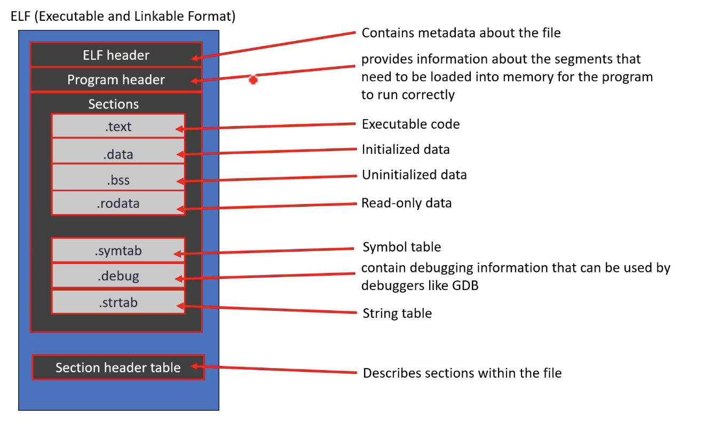     
    
> [!IMPORTANT]          
> Make sure you have **cargo-binutils** installed and the necessary components.     
> `cargo install cargo-binutils`      
> `rustup component add llvm-tools-preview`.      
    
- **cargo objdump -- -h <elf file>** Provides a high-level overview of the sections in the ELF file, including their sizes and addresses.     
    
- **cargo readobj -- -S/-h <elf file>** Provides detailed information about each section in the ELF file.      
   
# Startup code typically includes      
1. **Vector table**
  • Defines the initial stack pointer and the addresses of interrupt and exception handlers
2. **Reset Handler**
  • This is the entry point to our program which initializes the hardware and sets up the runtime environment
3. **Exception handlers**     
   
### Importance of start-up file     
• The startup file is responsible for setting up the right environment for the main user code to run
• Code written in startup file runs before main(). So, you can say startup file calls main()
• Some part of the startup code file is the target (Processor) dependent
• Startup code takes care of vector table placement in code memory as required by the ARM cortex Mx processor
• Startup code may also take care of stack reinitialization
• Startup code is responsible of .data, .bss section initialization in main memory      
     
> [!INFO].     
> startup file in this project `startup_stm32f303.rs`.    
    
**To complete the `reset_handler()`, we need section information. To get section information we need to write linker script.**      
     
### What is a linker script?
A linker script is a text file used by the linker to control the layout of the output executable file. It provides detailed instructions on how to map the input obiect files and their sections into the final executable file and how these sections should be placed in memory.     
    
• You can create custom sections that are not typically generated by the compiler. For example, you might want to create a section for specific types of data or code.     
• Control the exact placement of sections in memory, specifying which memory addresses to use for different sections.     
• Set attributes for sections, such as whether they are read-only, executable, or writable.      
    
## Linker     
**LLD (the LLVM linker)**:    
  This is the default linker Rust uses for the `{arm,thumb}*-none-eabi(hf)` targets and other similar embedded targets
**External Linker**:
  You can also configure Rust to use an external linker like *arm-none-eabi-ld*, which is part of the GNU Arm Embedded Toolchain.     
  add the following to your **.cargo/config.toml** `[target.<your-target>]`     
  linker = "arm-none-eabi-ld"

## Linker flags.      
Add this entry to **.cargo/config.toml** file of your project.     
**Uses default linker (rust-lld)**    
```toml
[target.thumbv7m-none-eabi]
rustflags = [
  "-C", "link-arg=-Tmemory.ld"
]
```     
* `memory.ld` is your linker script file.      
    
**Uses external linker**.      
```toml
[target.thumbv7m-none-eabi]
linker = "arm-none-eabi-ld"
rustflags = [
  "-C", "link-arg=-Tmemory.ld"
]
```      
- [More info on LLD of LLVM](https://lld.llvm.org/ELF/linker_script.html)     
- LLD implements a large subset of the GNU ld linker script notation as they are documented in ld [manual](https://sourceware.org/binutils/docs/ld/Scripts.html).     
- You can also refer to GNU linker [documentation](https://ftp.gni.org/old-gnu/Manuals/ld-2.9.1/html_chapter/ld_toc.html#TOC5) as it is compatible with LLVM linker     

## Important Linker scripts commands           
| Command  | Meaning |   
|----------|---------|  
| MEMORY | Defines memory regions available on the target device. |     
| SECTIONS | Tells the linker how input sections are mapped to output sections and placed in memory |     
| ENTRY | Specifies the entry point of the program |     
| OUTPUT | Specifies the name of the output file |     
| PROVIDE | Defines a symbol if it is not already defined |     
| ASSERT | Tests an assertion and stops linking if false |     
| KEEP | Ensures that the linker retains the specified sections |     
| AT | Specifies a different load address for a section |     
| ALIGN | Aligns the current location to a specified boundary |     
| LOADADDR(section) | Returns the absolute load address of the section |     
| SIZEOF | Returns the size of a section |     
| ORIGIN | Returns the origin address of a memory region |     
| LENGTH | Returns the length of a memory region |      

- For more info refer: https://ftp.gnu.org/old-gnu/Manuals/ld-2.9.1/html_chapter/ld_3.html#SEC6     

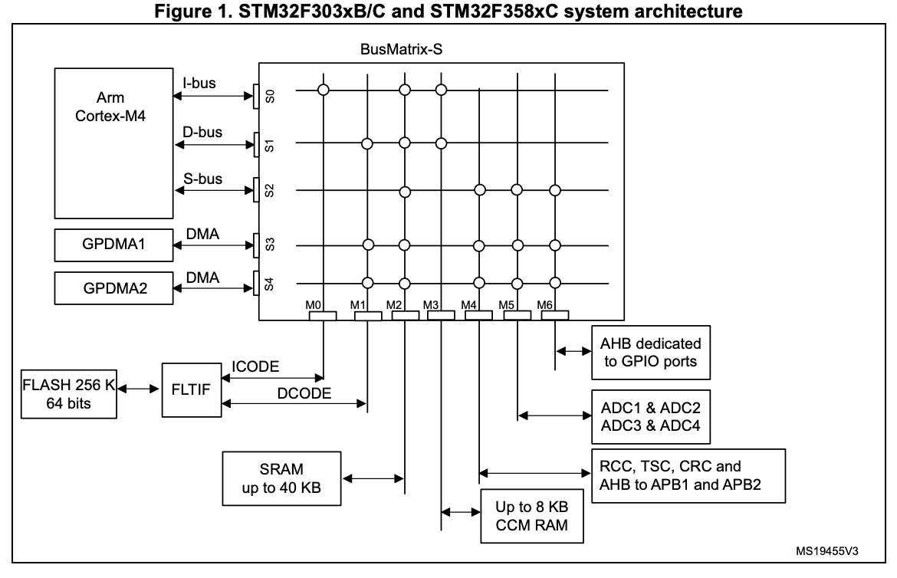       
   

## Memory layout attributes        
```ld
MEMORY
{
  FLASH (rx)    : ORIGIN = 0x08000000, LENGTH = 256K
  RAM (rwx)     : ORIGIN = Ox20000000, LENGTH = 64K
  CCMRAM (rwx)  : ORIGIN = 0x10000000, LENGTH = 64K

  /*non volatile data even powered off i.e. calibration, constants, config settings*/
  /* EEPROM (rwx)  : ORIGIN = 0x08080000, LENGTH = 4K */ 
  /* Battery backed RAM*/
  /* BATTRAM (rw)  : ORIGIN = 0x40024000, LENGTH = 4k */
}
```          
   
• Attributes i.e. (rwx) in a linker script specify the intended use of memory regions (e.g., read-only, writable, executable). They guide the linker in placing sections appropriately, especially for sections not explicitly listed in the script.   
     
• Attributes ensure that sections are placed in memory regions that match their required characteristics, helping to avoid incorrect memory usage and potential runtime errors.    
    
## Different types of data of a program      
A program contains various kinds of data, which can be categorized based on their storage location, mutability, and initialization state      
- Read-only data        
- Initialized data      
- Uninitialized data     
- Stack and heap data      

### Read-only data (.rodata)       
**Do not consume RAM space**   
- String literals      
- Constant variables (const)     
- Static immutable variables      
- Stored in ROM or Flash memory    
    
```rust
const PI: f64 = 3.141592653589793;         // constant variable
const NUMBERS: [i32; 5] = [1, 2, 3, 4, 5]; // constant array
static SCORES_GLOBAL: [i32; 5] = [1, 2, 3, 4, 5]; // static immutable array 

fn main() {
  let message = "This is a string literal."  // string literal
}
```      
    
```ld
.rodata :
{

} > FLASH
```     
    
**You can mention `AT` here i.e. `> FLASH AT> FLASH`. However redundant here as you use `AT` only when load address different than execution address**
      
      
### Initialised data (.data)     
**Rust does not have a separate concept of global variables as seen in some other languages. Global variables are handled through static variables**        
**Consume both ROM and RAM**       
- Initiliased static mut variables (global variables) .data      
- Initialised local variables (stack)      
- .data section is always part of the ROM and at runtime, are copied from ROM to RAM, where the program can modify them.     
      
```rust
// (Initiailzed global variable, data section)
static mut GLOBAL_COUNTER: 132 = 1;

fn main() {
  let local_var: 132 = 42; // Initialized local variable (stack)

  unsafe {
  // modifying global variable is unsafe in rust
  GLOBAL_COUNTER += 1;
  printin! ("Global counter: {}", GLOBAL_COUNTER);
}
```     

> [!NOTE]      
> Here, RAM address is also called as **Virtual Memory Address** (VMA). This is the address where the section is loaded in RAM at runtime      
> FLASH address is also called as **Load Memory Address(LMA)**. This is the address where the section is stored in FLASH initially before being copied to RAM during startup       

```ld
.data :
{

} > RAM AT> FLASH
```    
**Use `AT` only when load address is different than executiona address**
       
     
### Unintialised data (.bss)        
**ROM just stores size information of the .bss section RAM stores entire .bss section**
• Uninitialized global variables.
• Uninitialized static variables.
• Uninitialized static mut variables (typically zero-initialized).
• These data consume no significance space in the ROM, only metadata indicating the size of the .bs section. During runtime the startup code zeros out the .bass section in RAM      
     
```rust     
// This would go into the BSS section
static mut UNINITIALIZED_ARRAY: [u8; 1024] = [0; 1024];
fn main() -> ! {
  unsafe {
    UNINITIALIZED_ARRAY [0] = 1;
  }   
}
```          
      
### Stack:
• Local variables.
• Function call management (return addresses parameters).        
     
### Heap:
• Dynamically allocated memory (using Box, Vec, etc., in Rust).      
      
```rust
fn main() {
  // 42 is stored in heap during runtime
  let heap_allocated_data = Box::new (42);
  
  // [1, 2, 3, 4, 5] is stored in heap during runtime
  let vec_of_numbers = vec![1, 2, 3, 4, 5];
}     
```        
     
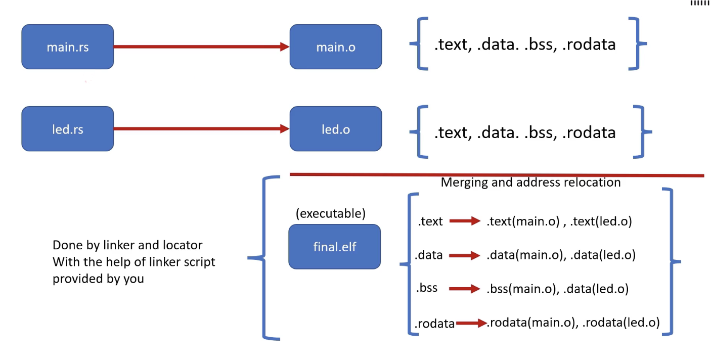          
      

## Location counter ('.')      
• The location counter (.) represents the current memory address within the section being processed.    
• As the linker processes the sections defined in the SECTIONS command, it automatically updates the location counter to reflect the current position in memory.      
• You can use the location counter to define the start or end of sections or to create gaps between sections by manipulating its value.     
    
- Below `_sdata` or `_sbss` (start data/bss) are linker symbols not variables    
    
```ld
  .data :
  {
  _sidata = LOADADDR(.data);   /* This returns the FLAS (LMA) of the .data section */
    _sdata = .;        /* start of data section in VMA(RAM) */
    *(.data)
    *(.data*)
    _edata = .;
  } > RAM AT> FLASH

  /* uninitialised data will be RAM */
  .bss : 
  {
    _sbss = .;
    *(.bss)
    *(.bss*)  
    _ebss = .;  
  } > RAM
```       
     
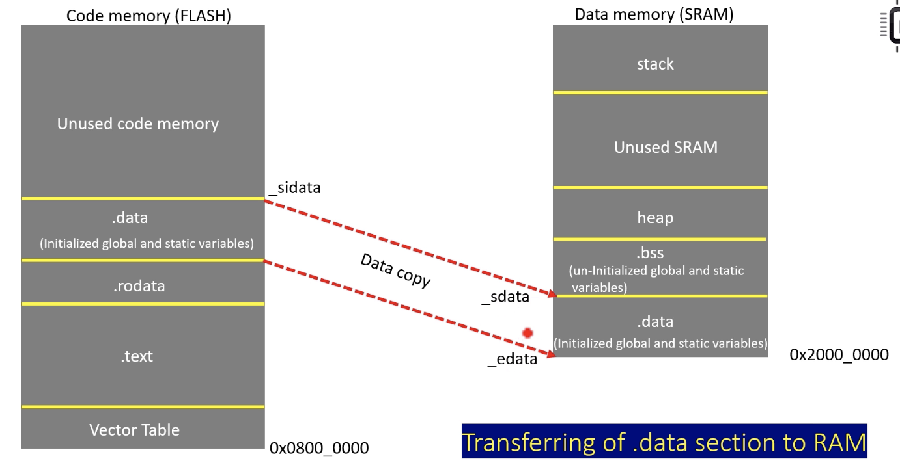 

### ALIGN(n)        
    
- Aligns the location counter to the next multiple of n bytes
  Example:
  ALIGN(4) => location counter is adjusted to the next address that is a multiple of 4. If the current address is already aligned to 4 bytes, it remains unchanged.       
  
- ALIGN ensures that your code and data sections are correctly placed at their natural and appropriate memory boundaries, preventing misalignment and potential faults      
      
```
SECTIONS
{
  .text :
  {
    /* . = 0x0800 0000 */
    . = ALIGN(4);
    /* here you should collect all executable code */
    *(.text)
    *(.text*)
    . = ALIGN(4);
  } > FLASH

  .rodata :
  {
    . = ALIGN(4);
    ...
    . = ALIGN(4);

  } > FLASH

  .data :
  {
    _sidata = LOADADDR(.data);   /* This returns the FLASH (LMA) of the .data section */
    . = ALIGN(4);
    _sdata = .;        /* start of data section in VMA(RAM) */
    *(.data)
    *(.data*)
    . = ALIGN(4);
    _edata = .;
  } > RAM AT> FLASH

  /* uninitialised data will be RAM */
  .bss : 
  {
    . = ALIGN(4);
    _sbss = .;
    ...
    . = ALIGN(4);
    _ebss = .;  
  } > RAM
}
```
      
### RAM usage check with the help of linker       
We reserver 1Kb for Stack and 1kb for heap. If the location counter goes beyond the maximum RAM size, the linker could throw error.    
```ld
  .ram_usage_check :
  {
    . = ALIGN(8);
    . = . + _min_stack_size;   /* 1kb = 1024bytes = 0x400 */
    . = . + _min_heap_size;
    . = ALIGN(8);
  } > RAM   
```

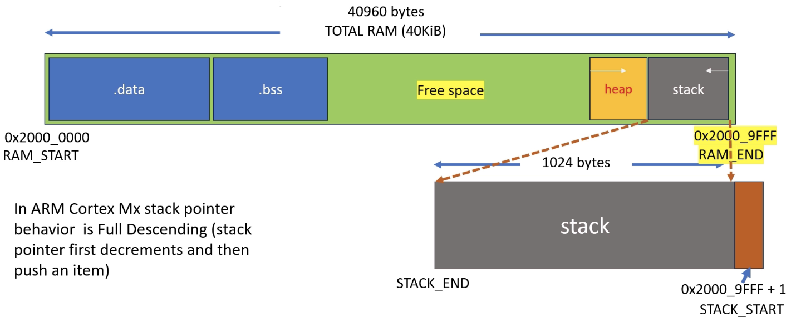     
     
> [!NOTE]       
> In ARM Cortex Mx processor, the stack pointer is aligned to 8 byte boundary. Because 8 byte boundary alignment is important during push and pop operations.    
> For example, consider a situation of pushing and popping a 64 bit data like double or long long. So there are 64 bit data types, and these data types should be stored at addresses that are multiples of 8 bytes for efficient access. And also 8 byte alignment inherently includes 8 byte alignment as well. 
> We have used `ALIGN(8)` in `.ram_usage_check` section       
      
## Test our program     
```bash
$ cargo clean
$ cargo build
$ cargo objdump -- -h target/thumbv7em-none-eabhif/debug/my_first_mcu_project

# ## ELF file inspection ##
# print all details of the ELF file
$ cargo readobj -- -all <elf file>

# print the contents of each section in an ELF file
$ cargo readobj -- -x .data|.rodata|.text <elf file>

# display the Symbol table
$ cargo readobj -- -s <elf file>
```        
       
# Startup code typically includes         
1. Vector table      
  • Defines the initial stack pointer and the addresses of interrupt and exception handlers
2. Reset Handler       
  • This is the entry point to our program which initializes the hardware and sets up the runtime environment
3. Exception handlers      
   
## Vector table         
The vector table is a collection of addresses that point to **Interrupt Service Routines (ISRs)** and **exception handlers**. The processor looks for this table at a specific, well-defined address in memory, usually at the beginning of the code space (often address 0x00000000 in many microcontroller architectures).       
     
### Vector table placement       
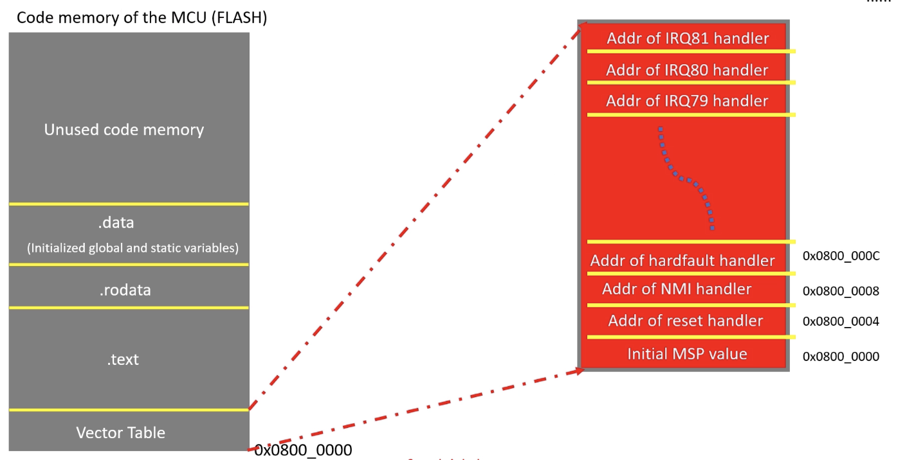          
     
### Exceptions & interrupts in STM32F303xB/C MCU        
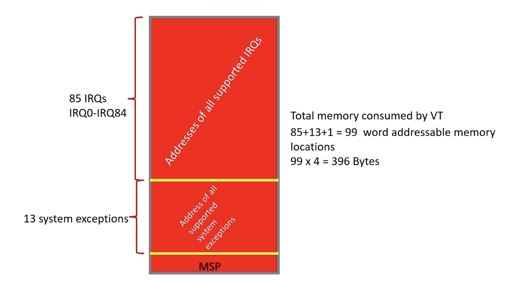         
      
> [!NOTE]        
> You don't have populate vector table in the `startup_stm32f303.rs` manually, instead use **svd-vector-gen** tool    
> Visit rust [crate](https://crates.io/crates/svd-vector-gen) and for STM32 microcontrollers, you can obtain SVD files by installing [STM32CubeCLT](https://www.st.com/en/development-tools/stm32cubeclt.html)      
> In MacOSx you can install however you don't find the installation directory as in window where you go to `C:\ST\STM32CubeCLT_1.16.0\STMicroelectronics_CMSIS_SVD`, the alternative is to download the svd from [github](https://github.com/modm-io/cmsis-svd-stm32) for STM32F303 and paste unto your project `my_first_mcu_project` root directory     
> Now install crate and run following command        
> `$ cargo install svd-vector-gen` and `$ svd-vector-gen`. This will generate `vector_STM32F303.txt` and `device_STM32F303.x`      
      
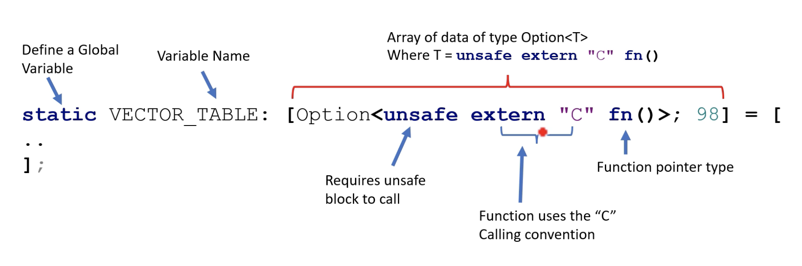     

## extern "C"
• When you use extern "C" in rust, you are telling the rust compiler to generate function call code that conforms to the C ABI on the target platform.      
This includes:    
  • Parameter passing conventions.    
  • Stack frame setup and teardown. (prologue/epilogue)     
  • Return value handling.     
  
• When targeting ARM with thumbv7em-none-eabi, using extern "C" ensures that the function will conform to the ARM EABI's implementation of the C ABI, making it compatible with other C code or system components compiled with ARM EABI.        

## Calling convention         
- calling convention refers to the rules that define how functions receive parameters, return values, and how the stack is managed during a function call.         
     
It dictates,  
- **Parameter passing**: which registers or stack lcoations are used to pass function arguments.      
- **Return values**: where the return value is placed (usually in a specific register)         
- **Stack management**: how the stack frame is set up and torn down, including how the return address is store and retrieved.      
   
**The calling convention ensures that function calls are consistent, so that the caller and callee agree on how data is passed and managed during the call.               
      
## Why extern "C" is mandatory for interrupt handlers?           
The ARM Cortex-M processors, commonly used in embedded systems, follow the ARM Embedded ABI (EABI) which is closely related to the C ABI. The EABI specifies how functions should be compiled, including the layout of the stack frame, register usage, and more. By using extern "C", you ensure that teh interrupt handler is compiled to match the ARM EABI expectations    

## PROVIDE();
**PROVIDE** directive in a linker script can be used to define a symbol as an alias for another symbol to as a fallback or default definition until an actual definition is provided elsewhere in the project.    
    
`PROVIDE(TIM1_isr = default_handler);`     
    
If the `TIM1_isr` is not defined elsewhere in your code, it will default to `default_handler`.        
      
It guarantees that the vector table will always have a valid function pointer for each interrupt, avoiding the scenario where an unhandled interrupt leads to undefined behavior  
   
> [!NOTE]         
> Once you add all the enteries to the linker script `memory.ld` as `PROVIDE(MemManage_Handler = Default_Handler);` or `INCLUDE "device_STM32F303.x"`. Now you can re-run the `cargo build`    
> And inspect the `.text` by `cargo readobj -- -x .text target/thumbv7em-none-eabihf/debug/my_first_mcu_project`       
     
### Top of the stack     
In our mcu, we have 40Kb of RAM. 40Kb x 1024 = 40960 to hex A000 as mcu is in little endian format hence, picture below, reverse the bytes i.e. 00a0 to a000    
      
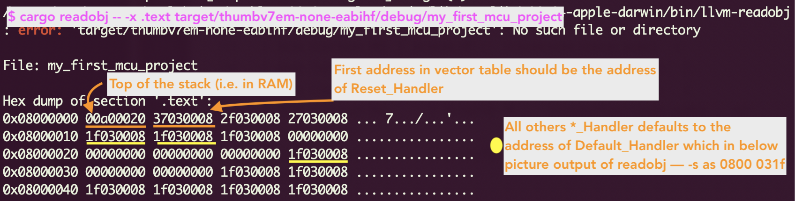     
    
First address i.e. *37030008* of the vector table must be the address of `Reset_Handler`      
To find out the address of particular symbol. we can read the symbol table by `cargo readobj -- -s target/thumbv7em-none-eabihf/debug/my_first_mcu_project`. You reverse the above address from *3703 0008* to *0800 0337* and you will find the in readobj command with -s flag as follows        
   
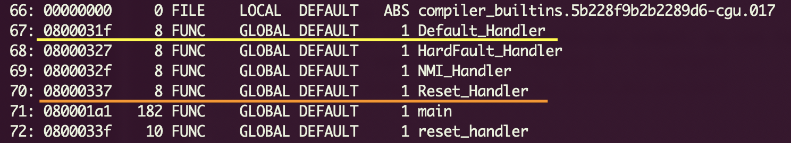      
   
In startup code we are left with **Reset Handler** as shown below      
   
### Startup code typically includes      
✅ 1. **Vector table**
  • Defines the initial stack pointer and the addresses of interrupt and exception handlers       
2. **Reset Handler** • This is the entry point to our program which initializes the hardware and sets up the runtime environment       
✅ 3. **Exception handlers**    

## Reset Handler       
As we previously seen, we have to copy the data section **.data**, which is stored in the flash memory to the SRAM that is the data memory.     
And then we also have to make space for the **.bss** variables and initialize them to zero in the SRAM.    
We already defined these linker symbols `_sdata`, `_edata`, `_sbss`, `_ebss` in the linker script. Now we have to make use of these linker symbols, and copy the data section from Flash to the SRAM.       
     
  
    
We will reference the linker symbols in the rust code with **extern**
```rust
unsafe extern "C" {
    unsafe static _sidata: u32;   /* start of .data in flash */
    unsafe static _sdata: u32;    /* start of .data in ram */
    unsafe static _edata: u32;    /* end of .data in ram */
    unsafe static _sbss: u32;     /* start of .bss in ram */
    unsafe static _ebss: u32;     /* end of .bss in ram */
}
```  
     
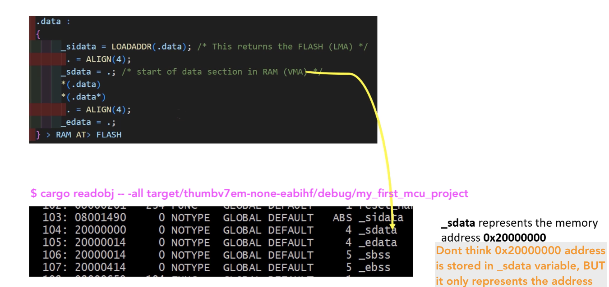   

To manipulate the addresses represented by linker symbol like `_sdata` etc, we created the static variables in the rust using **extern** block as shown above.     
     
## Raw pointers      
Raw pointers in rust (`*const T` and `*mut T`) do not adhere to the borrowing rules, data race prevention mechanisms, or other safety guarantees enforced by the Rust compiler for references (`&T` and `&mut T`). It is up to the programmer to ensure that raw pointer usage is safe.
You need to use an unsafe block to dereference raw pointers (`*const T` and `*mut T`)     
    
## Types of raw pointers     
1. Immutable raw pointer (*const T):    
This is a raw pointer used to point to data where the intention is that the data should not be modified through this pointer. It is similar in concept to a "const pointer" in languages like C and C++.      
    
2. Mutable raw pointer (*mut T):      
This raw pointer allows for mutation of the data it points to.      
    
> [!Note]    
> The data pointed to by a **const T** is not inherently constant or immutable in itself; rather, **const T** is a way to express the intent that the data should not be modified through this pionter.
    
### Comparison of pointers of C with Rust     
```rust  
// in C
int val = 10;
int *ptr_to_val = &val;
*ptr_to_val = 20;   

// in rust
let mut val = 10;

// `&mut val` -> mutable borrow of the `val` i.e. reference in safe rust
// now reference (i.e. &mut val) typecasted explicitly to raw pointer `as *mut i32`
let ptr_to_val = &mut val as *mut i32;
unsafe { *ptr_to_val = 20; }

println!("{}", val);

// in C immutable pointer
const int val = 10;
const int *ptr_to_val = &val; 
*ptr_to_val = 20; // Error 

// in rust immutable pointer
let val = 10;
let ptr_to_val: *const i32 = &val;  // immutable raw pointer
unsafe { *ptr_to_val = 20; }

println!("{}", val);
```    
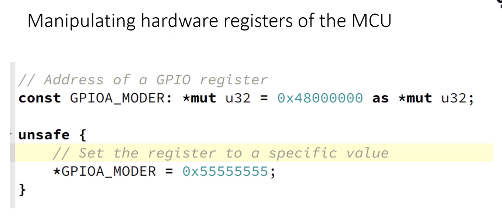   

> [!NOTE]     
> In an instance where you have global mutable variable like `static mut _sdata: i32 = 100;` and you typecast it into raw pointer like `let mutable_raw_pointer = &mut _sdata as *mut i32;`, you will get warning and possible error in the **2024 edition** that state; *creating a mutable reference to mutable static is discouraged*      
> you have to use macro `addr_of_mut` for mutable and `addr_of` for immutable from **std** library or in our case from **core** `use core::ptr` and then `let mutable_raw_pointer = ptr::addr_of_mut!(_sdata);`  
> These macros help you to create the immutable raw pointer instead of doing casting etc by yourself  
   
### What raw pointers lack compared to smart pointers in Rust?       
1. No safety guarantees: Dereferencing raw pointers is inherently unsafe.        
2. No automatic memory management: Raw pointers don't manage memory allocation or deallocation.       
3. No borrowing and ownership enforcement: Raw pointers bypass rust's ownership and borrowing rules.       
4. No Lifetimes: Raw pointers don't enforce lifetimes, risking dangling pointers.       
5. Potential for data races: Multiple mutable raw pointers can point to the same location without checks.       
6. No reference counting: Unlike Rc<T> or Arc<T>, raw pointers don't keep track of references.      
7. No runtime borrow checking: Unlike RefCell<T>, raw pointers don't check borrowing rules at runtime.     
8. Direct risk of undefined behavior     
11.No Thread-Safety guarantees     
     
# Flash and Debug       
To flash and debug the elf for STM32 mcu, you need a debugger, either onboard or offboard, such as ST-Link, J-Link, or a JTAG debugger.     
      
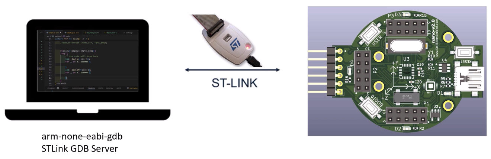   
    
## Programming Fastbit STM32 Nano board     
Fastbit STM32 Nano board can be programmed in two ways:     
- To flash and debug, you can use **ST-Link** externally connected to the board      
- To program the board, **UART**, without debugging capability then you can connect the board to the host pc via a usb cable as board already has on-board virtual com support. So the moment you connect this board to the pc the board will enumerate as virtual com.    
     
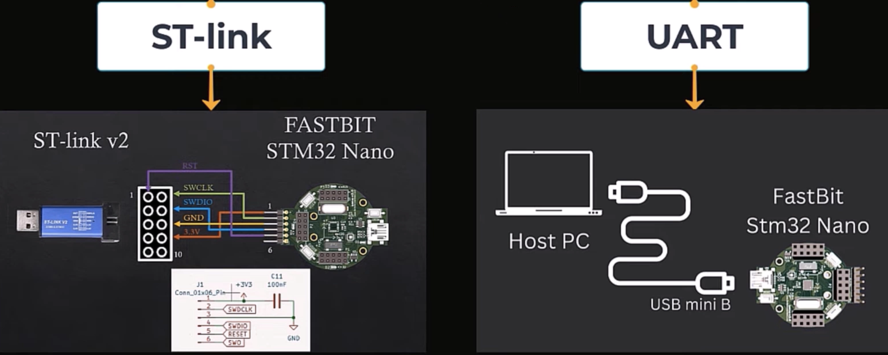       


   


   

        

              